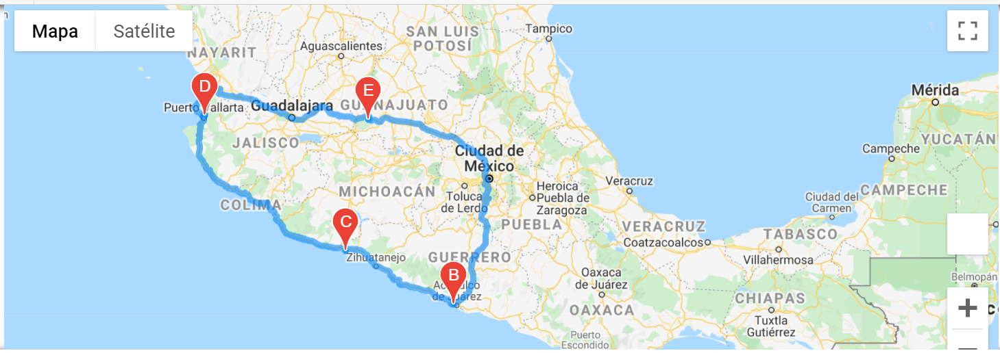

# World Weather Analysis

## Project Overview

Plan My Trip is one of the top travel technology companies specializing in Internet-related services in the hotel industry. 
We were in charge of collecting and presenting data for customers via a search page, which they will then filter based on weather preferences which will be used to identify potential travel destinations and nearby hotels. Also, this data helped us to predict the best time of year for people to plan their vacations.

## Resources

  - Data Source: WeatherPy_Database.csv
  - Software: Python 3.9.7, Jupyter Notebook and Pandas 1.2.4
  - Modules: Jupiter Gmaps and City PI
  - API: OpenWeather, Google Maps and Google Places
